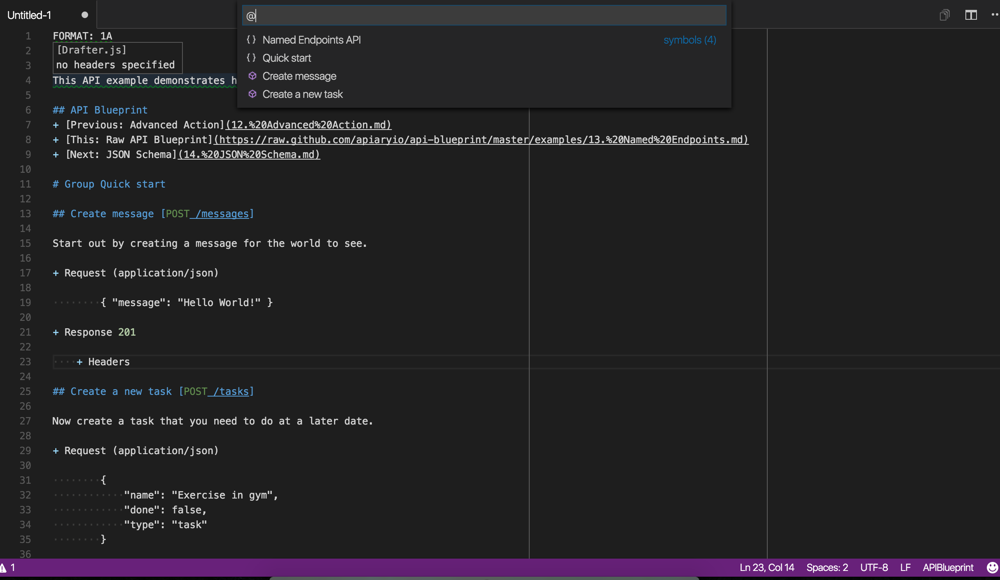

## [API Elements](http://api-elements.readthedocs.io/en/latest/) for [Visual Studio Code](https://code.visualstudio.com)

Welcome to the API Elements extension for Visual Studio Code! This is a [totally untested](https://github.com/XVincentX/vscode-apielements/issues/8) extension which will improve your experience working with API description formats like [API Blueprint](https://apiblueprint.org) and [Swagger](https://swagger.io). It provides some great features, such as:

* Syntax highlight
* Parser error and warnings
* Useful snippets
* [Basic Apiary Integration](#basic-apiary-integration)
* Parser output
* [Basic symbol navigation (CMD + @)](#symbol-navigation)

### What's API Elements about?

API Elements is the structure for parse results of both API Blueprint and Swagger, and it is built on the [Refract](https://github.com/refractproject/refract-spec#refract) format. It provides a single format for interacting with parse results from various API description formats. So far, only API Blueprint and Swagger are supported.

----

**Warning: This package is alpha and probably might be buggy,** but I decided to share the progress for those who are interested. Proceed at your own risk!

-----

### Future development / ideas
* Render the document using `aglio`
* Provide autocomplete (if I type `+ Request [` I want to see Http verbs, or in payloads I want to recall MSON structures)
* Use Codelens feature to provide MSON references and Dredd test status for endpoint
* Integrate with other API tools (see [Dredd](https://github.com/apiaryio/dredd) or [drakov](https://github.com/Aconex/drakov))

### Found a Bug or - do you need a particular feature?
Please file an issue at https://github.com/XVincentX/vscode-apielements.

### Development

First install:
* Node.js (newer than 4.3.1)
* Npm (newer 2.14.12) - probably 3.x would be even better

This extension is built on top of Visual Studio template; so:

To **run and develop** do the following:

* For both `server` and `client` directory (in the exact order):

* Run `npm i`
* Open the server in Visual Studio Code (`code .`) and run the `build` task
* Open the client in Visual Studio Code (`code .`) and run the `launch` task
* Press F5 in the server to debug and use the extension in the VS Host instance.

## Notes

### Symbol navigation
Symbol navigation is strongly dependant on sourcemaps quality provided by the parser.
Currently, the following resources are indexed:

1. [API Title]()
2. [resource]()
3. [resourceGroup](http://api-elements.readthedocs.io/en/latest/element-definitions/#properties_6)
4. [transitions]()

The idea would be, of course, to improve symbol navigation as much as possible and exploit
sourcemaps in all their power. This, however, might take time. If you feel there are some
important symbols I'm missing, please file an issue, I'll be happy to evaluate it.

### Basic Apiary Integration
This extension is able to provide basic Apiary integration. Fundamentally, all
[Apiary client](https://github.com/apiaryio/apiary-client) have been reimplemented
following the [Apiary API documentation](http://docs.apiary.apiary.io). It means that
you can perform the following actions:

1. Fetch an API Description Document from your account
2. Publish an API Description Document to your account

without having to leave the editor at all.

Most of the process is actually automated. Thous, it will ask you to provide a 
token and redirect you to the right page if it's not avaliable on your computer.
All those commands are listed with an `Apiary` prefix. Therefore, to see what you
can do, simply type `Apiary` in the command box to see what's going on.

#### Acknowledges
Even if I currently work for Apiary, this extension is my personal work and it's not backed by Apiary.
